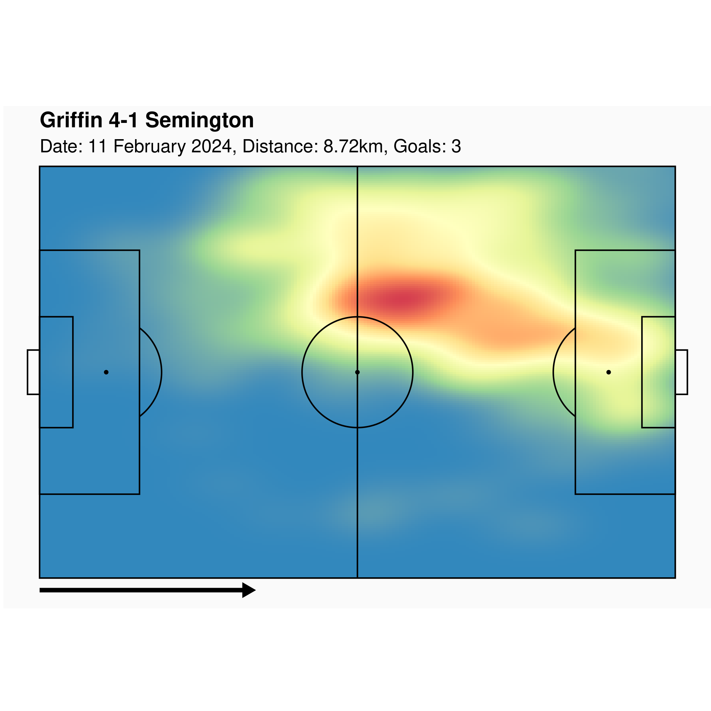

Run the app: 

- Via the R console: `shiny::runGitHub(repo ="garmin-football", username = "pawleymatthew")`
- In web browser: <https://pawleymatthew.shinyapps.io/garmin-football/>

# Recording Instructions:

1. Start a Garmin activity with "Auto Lap = Manual Only" and "Lap Key = On"
2. Press the Lap button to create breakpoints in the match, for example
   i) at the start and end of a long break in play, e.g. due to an injury;
   ii) at the start and end of the half time break.
3. Press 'Stop' and 'Save' at full time.

# Using the app

1. Find the relevant activity on Garmin Connect or Strava, and click `Export Original`.
2. If required, extract the the `.fit` file from the `.zip` file.
3. Upload the `.fit` file.
4. Set the pitch boundaries by placing the markers at the corners, toggling between the OpenStreetView and Satellite map views if necessary. The marker labels indicate the positions ("RB" = right back, "RF" = right forward etc.) with respect to the **1st half** direction of attack. 
5. Select which half (1st/2nd) each lap was part of. Laps that you don't want to contribute to the heatmap (e.g. a break in injury) should be left unchecked. The only effect of designating halves is that 2nd half laps will be flipped. If you did not swap ends at half time, then designate all laps as 1st half.
6. Enter the number of goals scored (if you want this to appear in the plot subtitle).
7. Write a title for the plot. Choose what information you want the subtitle to contain.
8. Click `Generate heatmap` to make the graphic. Thereafter, the graphic will update automatically when inputs are updated.
9. Click `Download` to save the plot as a PNG file. 

# Example data

An example file is provided in the `data` folder.

### Griffin FC 8-0 The Pewsham, 10 December 2023

`football-2023-12-10.fit`

- Match info: <https://fulltime.thefa.com/displayFixture.html?id=25855067>
- First half = laps 1 and 3.
- Second half = lap 5 (cut short, accidentally paused watch midway through!).
- Laps 2 (break in play due to injury) and 4 (half time) should be excluded.
- Player is a left-winger attacking south-eastward in the first half.

# To be added/completed

- Summary stats (distance, time, speed, no. sprints) for each half.
- Some CSS to make it look a bit nicer.
